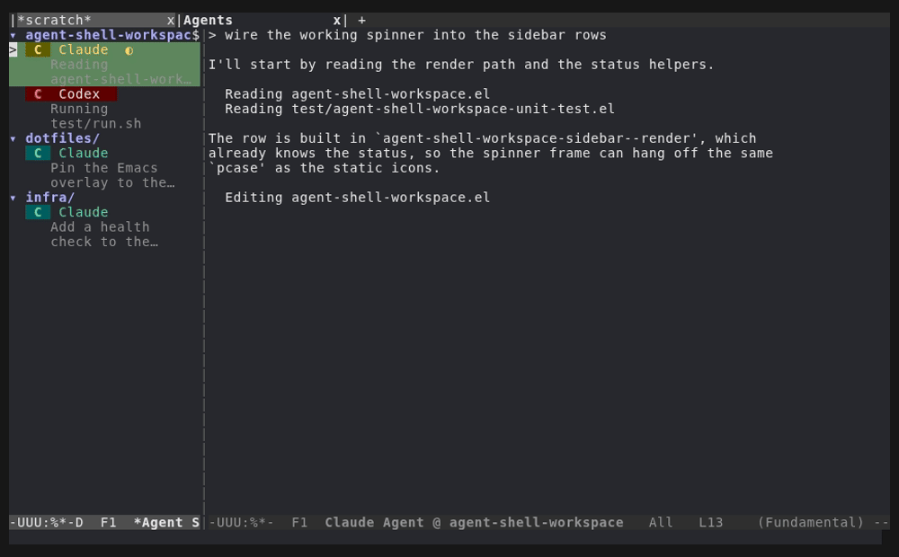

# agent-shell-workspace

A dedicated tab-bar workspace for [agent-shell](https://github.com/xenodium/agent-shell) buffers in Emacs.

Toggle into an "Agents" tab with a compact sidebar, buffer isolation, and tiling — then toggle back to your regular work. Non-agent buffers never pollute the workspace.



## Features

- **Dedicated tab-bar tab** — one keypress between coding and agent monitoring
- **Compact sidebar** — each agent's icon, status, and name at a glance, grouped by project and foldable
- **Status icons** — `●` ready, `◐` working, `◉` waiting for input, `✔` finished, `○` initializing, `✕` killed. Busy rows animate (`◐ ◓ ◑ ◒`)
- **Live activity summary** — a small-print line under each row: the session title, or what the agent is doing right now ("Reading foo.el", "Running tests")
- **Buffer isolation** — opening a file or a non-agent buffer redirects to your editing tab
- **Tiling** — 2–8 agents side-by-side in an auto-arranged grid
- **Quick switch** — peek at agents by moving up and down the list without losing focus
- **One-shot picker** — pop the list up, pick an agent, and the current window jumps to it
- **Agent management** — kill, restart, rename, set mode, interrupt, all from the sidebar

## Requirements

Emacs 29.1+ and [agent-shell](https://github.com/xenodium/agent-shell) 0.24.2+.

## Installation

```elisp
(use-package agent-shell-workspace
  :vc (:url "https://github.com/gveres/agent-shell-workspace")
  :ensure t
  :after agent-shell
  :bind (("C-c A w" . agent-shell-workspace-toggle)
         ("C-c A p" . agent-shell-workspace-pick)))
```

Or download `agent-shell-workspace.el` into your `load-path` and `(require 'agent-shell-workspace)`.

## Usage

Press `C-c A w` to toggle the workspace: the Agents tab opens with the sidebar on the left and your most recent agent in the main area. Press it again to go back.

### Sidebar keybindings

| Key | Action |
|-----|--------|
| `RET` | Focus agent in main area |
| `n` / `p` (or `↓` / `↑`) | Next/previous agent or group header |
| `TAB` | Fold or unfold the project group |
| `s` | Toggle quick-switch (peek on cursor move) |
| `a` / `x` / `t` | Add to / remove from / leave the tiled view |
| `R` | Rename agent buffer |
| `c` | Create new agent |
| `k` | Kill agent process |
| `r` | Restart agent |
| `d` | Delete all killed buffers |
| `m` / `M` | Set / cycle session mode |
| `C-c C-c` | Interrupt agent |
| `g` | Refresh sidebar |
| `q` | Close sidebar |

### One-shot picker

`agent-shell-workspace-pick` (`C-c A p`) pops the sidebar up as a one-time picker: navigate to an agent, press `RET`, and the window you came from switches to it while the sidebar closes again. `q` cancels. No tab is created and your layout is left alone — a quick jump to an agent from wherever you are.

`agent-shell-workspace-sidebar-toggle` behaves the same way by default. For a persistent sidebar that stays up across selections and leaves your cursor where it was:

```elisp
(setq agent-shell-workspace-sidebar-one-shot nil)
```

### Tiling

Press `a` on each agent you want tiled. The first press marks it (shown with `▫`), the second splits the window. Up to 8 agents; `x` removes one, `t` un-tiles.

### Summary lines

The line under each row shows the latest tool-call title while the agent works, and the session title otherwise. Several agents in one project render the same short name, so this is often the only thing telling them apart.

| Variable | Default | |
|----------|---------|-|
| `agent-shell-workspace-sidebar-show-session-title` | `t` | nil hides summaries entirely |
| `agent-shell-workspace-sidebar-summary-height` | `0.85` | relative font height |
| `agent-shell-workspace-sidebar-summary-indent` | `5` | left margin, in characters |
| `agent-shell-workspace-sidebar-summary-lines` | `2` | maximum lines per summary |

### Buffer isolation

In the Agents tab, anything that would display a non-agent buffer (`find-file`, `xref`, `switch-to-buffer`) switches you to your previous tab first. Agent-related buffers — diffs, traffic logs — are allowed through.

## Development

```sh
test/run.sh
```

Two phases: a unit suite under `emacs --batch` for pure logic, then an end-to-end suite in a real terminal Emacs, because window-point and redisplay bugs do not reproduce in batch mode. The whole run takes about a second and a half.

The demo GIF is scripted with [vhs](https://github.com/charmbracelet/vhs) — the agents in it are fakes, so it records identically every time:

```sh
vhs docs/demos/sidebar.tape
```

## Acknowledgements

Status detection logic adapted from [agent-shell-manager.el](https://github.com/jethrokuan) by Jethro Kuan.

## License

GPL-3.0-or-later
